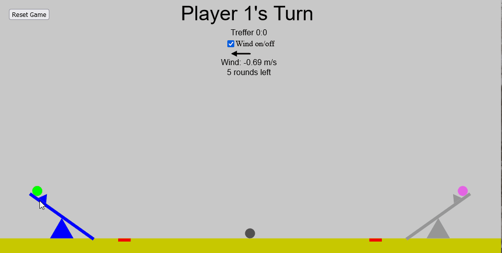

# Game Physics

Web-Game using P5.js developed as lab exercise during the summer semester at HTW Berlin

Implementation of physical forces (e.g. collisions, gravity, throwing...)

see https://lariwa.github.io/Game-Physics/ for project

